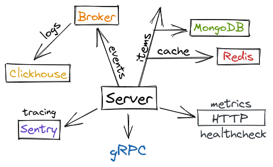

### ⚠️ The project is under development, all versions until `1.0.0` are considered as not backward compatible.

[](https://github.com/illiafox/grpc-lake/actions/workflows/go.yml)
[](https://github.com/illiafox/grpc-lake/actions/workflows/docker-image.yml)
[](https://github.com/illiafox/grpc-lake/actions/workflows/golangci-lint.yml)

### Requirements

* **Redis:** `7.0`
* **MongoDB:** `5.0`
* **ClickHouse:** `22.6.8`
* **RabbitMQ:** `3.10.7`
* **Go:** `1.19`
* **Sentry** (optional)

---

## Deployment

```shell
make compose # docker-compose up
```

### Endpoints

* `8080` - **gRPC**
* `8082` - **HTTP** `/metrics`, `/debug/pprof`, `/healthcheck`
* `6379` - **Redis** without password
* `27017` - **MongoDB** `server:pass`
* `15672` `5672` - **RabbitMQ** `guest:guest`
* `8123` `9000` `9009` - **ClickHouse** `default:default`

---

### Protobuf files

#### [Service](api/item_service/service/v1/item.proto) `service/v1/item.proto`

#### [Model](api/item_service/model/v1/item.proto) `model/v1/item.proto`

---

### Config

Copy [`.env.example`](.env.example) to `.env` and change values if needed.
Credentials are rewritten by docker-compose. 

If you want to enable **Sentry**, set `SENTRY_DSN` value.

Some useful options:

* `CACHE_EXPIRE=1m` Cache expiration time

* `REDIS_POOL_TIMEOUT=5s`  Pool connection timeout
* `REDIS_POOL_SIZE=-1` Pool size, `-1` means default (**10** * [`runtime.GOMAXPROCS`](https://pkg.go.dev/runtime#GOMAXPROCS))
* `REDIS_IDLE_SIZE=-1` Idle pool connections, `-1` means default (`REDIS_POOL_SIZE` / **4**)

* `RABBITMQ_XXX` - All **RabbitMQ** options (both exchange and queue)


---

### Tests

* [x] Mocks
* [x] Unit tests
* [ ] Integration - soon

``` shell
make test
```

### Sentry
All internal errors are sent to **Sentry**. If `SENTRY_DSN` is not set, they will be ignored.

Tracing rate is tuned by the `SENTRY_TRACING_RATE` value (default `1.0` -> all traces will be sent).

### Clickhouse
```sql
TABLE events
(
    timestamp DATETIME,
    item_id   String,
    action    String
)
```

### Logs

``` shell
# Terminal (stdout)
05/09 07:39:33 +0000 | INFO | app/listen.go:30 | gRPC server started {"port": 8080}
05/09 07:39:33 +0000 | INFO | app/listen.go:42 | HTTP server started {"port": 8082}
```

``` shell
# File (default log.txt)
{"level":"info","ts":"Mon, 05 Sep 2022 07:39:33 UTC","caller":"app/listen.go:30","msg":"gRPC server started","port":8080}
{"level":"info","ts":"Mon, 05 Sep 2022 07:39:33 UTC","caller":"app/listen.go:42","msg":"HTTP server started","port":8082}
```

---

### Todo:

* [x] Collect events logs
* [x] Sentry
* [ ] Add integration tests
* [ ] Yaml config


### Contributors

* [**@ShiroNoHaga**](https://github.com/ShiroNoHaga) .env.example idea
